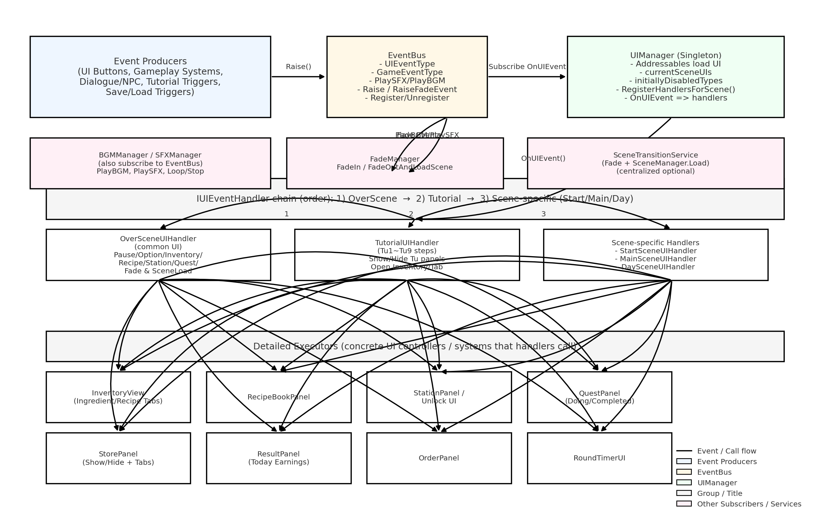

# 🎛️ UI·오디오·페이드 전환 통합 이벤트 시스템 — README



Unity 기반 레스토랑 시뮬레이션의 **UI, 오디오, 페이드 전환**을  
**EventBus → UIManager → IUIEventHandler 체인** 및 **직접 구독 매니저** 구조로 느슨하게 연결하여 제어합니다.  
이 구조는 **씬 전환, UI 토글, BGM·SFX 제어, 페이드 연출**을 모두 일관된 이벤트 방식으로 관리합니다.

---

## 📂 폴더 구조
UIFlow/
├─ Core/
│ ├─ EventBus.cs # 모든 UI/게임/연출 이벤트 허브
│ └─ UIManager.cs # Addressables 로드, 핸들러 체인 관리
├─ Handlers/ # IUIEventHandler 구현체
│ ├─ OverSceneUIHandler.cs # 전 씬 공통 UI
│ ├─ TutorialUIHandler.cs # 튜토리얼 전용 UI
│ ├─ StartSceneUIHandler.cs
│ ├─ MainSceneUIHandler.cs
│ └─ DaySceneUIHandler.cs
├─ Views/ # 실제 UI 패널 컨트롤러
│ ├─ InventoryView.cs
│ ├─ RecipeBookPanel.cs
│ ├─ StationPanel.cs
│ ├─ QuestPanel.cs
│ ├─ StorePanel.cs
│ ├─ ResultPanel.cs
│ ├─ OrderPanel.cs
│ └─ RoundTimerUI.cs
└─ Presentation/
├─ BGMManager.cs # BGM 재생/페이드 관리
├─ SFXManager.cs # SFX 재생/루프 관리
└─ FadeManager.cs # 페이드 연출 및 씬 전환

---

## 1️⃣ 핵심 설계

### A. 이벤트 허브: **EventBus**
- **UIEventType / GameEventType / BGMEventType / SFXType / FadeEventType**를 정의하고 통합 브로드캐스트.
- UI 전환(`Raise`), BGM 재생(`PlayBGM`), SFX 재생(`PlaySFX`), 페이드(`RaiseFadeEvent`) 모두 동일 경로로 호출.
- 일부 시스템(오디오, 페이드)은 UIManager를 거치지 않고 EventBus를 직접 구독.

### B. UI 진입점: **UIManager**
- Addressables로 씬별 UI 프리팹 로드 → `currentSceneUIs`에 부착.
- `RegisterHandlersForScene()`로 **핸들러 체인** 구성:
  1. **OverSceneUIHandler** — 전 씬 공통 UI
  2. **TutorialUIHandler** — 튜토리얼 UI
  3. **씬별 핸들러** — Start / Main / Day Scene
- `OnUIEvent()`에서 순서대로 핸들러 `Handle()` 호출 → `true` 반환 시 전파 중단.
- 특정 UI는 `initiallyDisabledTypes`로 초기 비활성 처리.

### C. 핸들러 체인 (IUIEventHandler 구현체)
1. **OverSceneUIHandler**  
   - 공통 UI(인벤토리, 레시피, 스테이션, 퀘스트, 옵션, 페이드 씬전환 등) 제어.
2. **TutorialUIHandler**  
   - 튜토리얼 Tu1~Tu9, 단계별 UI 표시/탭 전환.
3. **씬별 UI 핸들러**  
   - StartSceneUIHandler, MainSceneUIHandler, DaySceneUIHandler

### D. 오디오 & 페이드 매니저 (EventBus 직구독)
- **BGMManager**  
  - `OnBGMRequested` 구독.
  - 이벤트 타입에 따라 BGM 선택, 일부는 페이드 적용.
  - `FadeOutAndPlayNew`, `FadeOutAndStop`로 부드러운 전환.
  - `SetVolume`으로 실시간 볼륨 변경.
  
- **SFXManager**  
  - `OnSFXRequested`, `OnLoopSFXRequested`, `OnStopLoopSFXRequested` 구독.
  - 풀링 기반 오디오 소스 관리, 부족 시 동적 생성.
  - 루프 SFX는 type별 AudioSource 유지.
  - `SetVolume`으로 전체 효과음 볼륨 조절.
  
- **FadeManager**  
  - `OnFadeRequested` 구독.
  - `FadeTo`로 투명도 변화, `FadeOutAndLoadScene`으로 씬 전환.
  - 씬 로드시 `LoadingTargetHolder.TargetScene` 설정 후 로딩씬 로드.
  - `OnFadeCompleted` 이벤트로 완료 알림.

### E. 실행 주체: Views
- 핸들러가 직접 View 메서드 호출(`Show()`, `Hide()`, `OpenTab()`) 혹은 `SetActive` 토글.
- UI 갱신·애니메이션·데이터 바인딩을 실제 수행.

---

## 2️⃣ 이벤트 흐름

1. **발신자**(버튼 클릭, 게임 시스템, 튜토리얼 트리거)가 EventBus 호출  
```csharp
EventBus.Raise(UIEventType.ShowInventory, null);
EventBus.PlayBGM(BGMEventType.Intro1);
EventBus.PlaySFX(SFXType.ButtonClick);
EventBus.RaiseFadeEvent(FadeEventType.FadeOutAndLoadScene, 
    new FadeEventPayload(1f, 1f, scene: "MainScene"));
```
2. UI 이벤트 → UIManager.OnUIEvent() → 핸들러 체인 → View 제어

3. BGM/SFX/Fade 이벤트 → 해당 매니저 직구독 → 연출 실행

## 3️⃣ 대표 시나리오
시나리오 1: 튜토리얼 중 인벤토리 열기 + 효과음


EventBus.Raise(UIEventType.ShowInventory, null);
EventBus.PlaySFX(SFXType.UIOpen);
시나리오 2: 씬 전환 + BGM 교체

```csharp
EventBus.RaiseFadeEvent(FadeEventType.FadeOutAndLoadScene,
    new FadeEventPayload(1f, 1f, scene: "MainScene"));
EventBus.PlayBGM(BGMEventType.MainTheme);
```
